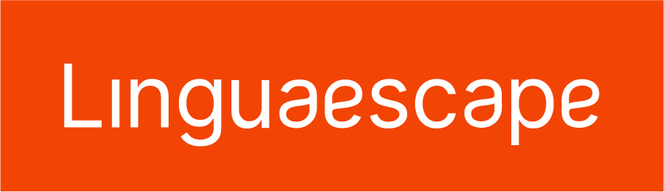
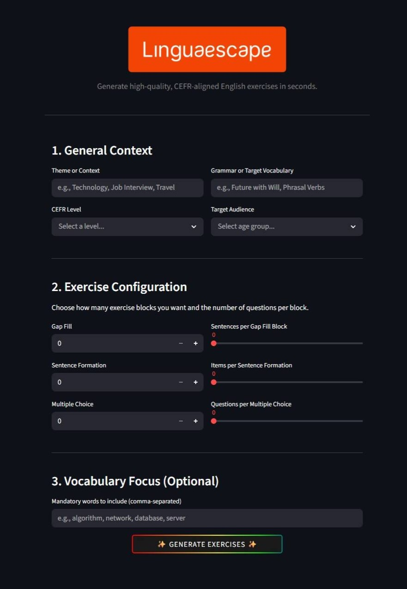

<p align="center">
  
</p>

**Linguaescape** é uma aplicação web full-stack baseada em IA Generativa, desenvolvida para automatizar a criação de recursos educacionais para o ensino da língua inglesa. O projeto une a tecnologia de LLMs com os requisitos do CEFR (*Common European Framework of Reference for Languages*), para que professores gerem exercícios personalizados e prontos para impressão em segundos.

A ideia nasceu de uma necessidade real: agilizar a elaboração de material didático, uma demanda criativa e exaustiva na rotina da desenvolvedora como professora de inglês.

Apesar das diversas ferramentas de IA que auxiliam nesse processo, elas frequentemente geram retrabalho, pois exigem inúmeras tentativas de prompts para acertar a estrutura. Além disso, correm o risco de fugir do nível solicitado e forçam o professor a garimpar questões, copiando, colando e formatando tudo manualmente em editores de texto.

Embora a revisão do professor continue sendo indispensável, o fluxo de trabalho é simplificado. O sistema elimina a necessidade de criar prompts e a diagramação manual, entregando as atividades na quantidade exata, validadas pedagogicamente e estruturadas em um PDF pronto para a sala de aula.

---

## 🏗️ Arquitetura

- **RAG Tabular (Retrieval-Augmented Generation):** Utiliza `pandas` para ler e filtrar a base oficial de descritores do CEFR por nível, injetando essas regras rígidas como contexto no prompt da IA.
- **Validação de Contrato de Dados:** Utilização do Pydantic nos schemas para garantir regras de negócio antes do processamento, forçando a IA a devolver as respostas em um formato JSON previsível para o gerador de PDF.
- **Agente Semântico:** Criação de um filtro na etapa de pós-processamento (`services.py`) que avalia e cobra as justificativas pedagógicas da IA, bloqueando conteúdos que não correspondam exatamente à teoria da base de dados.
- **Controle Granular:** Os schemas estruturam três tipos diferentes de exercícios (*Gap Fill*, *Sentence Formation* e *Multiple Choice*), permitindo ao usuário definir blocos e a quantidade específica de itens para cada um.
- **Geração de PDF Inclusiva:** Uso da tipografia *Atkinson Hyperlegible* (desenvolvida pelo Braille Institute) na renderização final para garantir legibilidade e acessibilidade aos alunos.
- **Arquitetura Desacoplada:** API RESTful desenvolvida em FastAPI (rodando assincronamente via Uvicorn), totalmente separada e independente da interface de usuário em Streamlit.


---

## 🖥️ Interface

Em aplicações baseadas em IA Generativa, a qualidade do material gerado depende da precisão das instruções. Para eliminar a "fadiga de prompt", **o usuário não precisa escrever nenhum comando para a IA**. 

A interface substitui o chat tradicional por seletores e campos paramétricos. O professor apenas configura a aula e o sistema constrói, de forma invisível, um prompt robusto e altamente calibrado, reduzindo o risco de alucinações.

O fluxo é estruturado em três etapas vitais:
1. **General Context:** Define as fundações (tema, alvo gramatical, nível CEFR e faixa etária), impedindo o uso de vocabulário fora do nível cognitivo adequado ao aluno.
2. **Exercise Configuration:** Impõe restrições de formato, onde o professor define a quantidade exata de itens em cada bloco, forçando a IA a ser concisa e precisa.
3. **Vocabulary Focus (Opcional):** Um campo de injeção direta que obriga o modelo a aplicar palavras-chave específicas da lição no contexto criado.

<p align="center">
  
</p>

<p align="center">
  <strong><a href="images/example/example-1.pdf">📄 Clique aqui para abrir um exemplo do material final gerado (PDF)</a></strong>
</p>

---

## 📁 Estrutura do Projeto

```text
linguaescape-ai/
├── data/               # Base de dados tabular (Descritores do CEFR)
├── font/               # Tipografias de acessibilidade
├── images/             # Logotipos, interface e exemplo de PDF
├── utils/              # Lógica de RAG e renderizador do PDF gerado
├── app.py              # Frontend / Interface Gráfica (Streamlit)
├── main.py             # Entrypoint da API RESTful (FastAPI)
├── router.py           # Definição das rotas e endpoints
├── services.py         # Orquestração da IA e agente semântico
├── schemas.py          # Contratos e validação de dados (Pydantic)
├── Dockerfile          # Receita de containerização
└── docker-compose.yml  # Orquestração dos serviços (Backend + Frontend)
```

---

## 🛠️ Tecnologias
* **Linguagem:** Python 3.x
* **IA / LLM:** Google Gemini 2.5 Flash (`google-genai`)
* **Frontend:** Streamlit
* **Backend:** FastAPI, Uvicorn, Pydantic
* **Análise de Dados:** Pandas, Openpyxl
* **Exportação:** FPDF2
* **DevOps:** Docker, Docker Compose

---
### Acesse o App: [https://linguaescape.streamlit.app/](https://linguaescape.streamlit.app/)
---